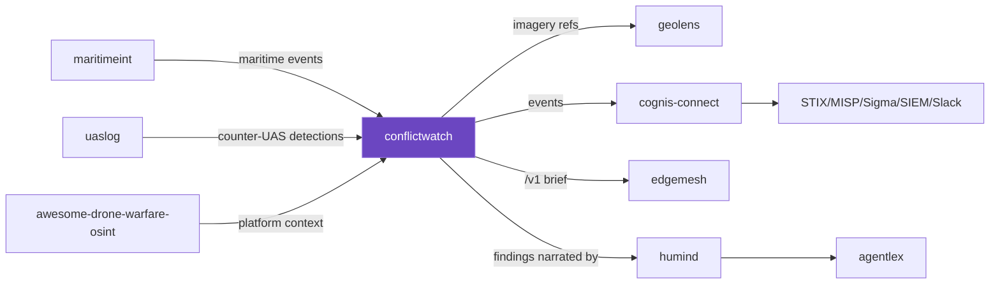

# Cognis interop map

How **conflictwatch** fits the wider Cognis suite — open-source situational awareness that
composes with the maritime, drone, and threat-intel tools, all on your own hardware.



## Key edges

| from | relation | to |
|---|---|---|
| conflictwatch events | normalized + forwarded by | [`cognis-connect`](https://github.com/cognis-digital/cognis-connect) |
| [`maritimeint`](https://github.com/cognis-digital/maritimeint) / [`uaslog`](https://github.com/cognis-digital/uaslog) | domain events feed | conflictwatch situational picture |
| [`awesome-drone-warfare-osint`](https://github.com/cognis-digital/awesome-drone-warfare-osint) | platform/component context for | conflictwatch drone/uas events |
| [`geolens`](https://github.com/cognis-digital/geolens) | geolocates imagery referenced in | conflictwatch OSINT |
| conflictwatch | analyst brief via `/v1` | [`edgemesh`](https://github.com/cognis-digital/edgemesh) |

## Composition patterns

```bash
# conflict events -> STIX bundle for your TIP
conflictwatch ingest --source acled --from-file acled.csv | python -m conflictwatch.connect --to stix
# maritime + land in one picture: merge maritimeint + conflictwatch JSON, then analyze
# OSINT feeds -> Slack situational channel
conflictwatch scrape | python -m conflictwatch.connect --to slack --url $SLACK --dry-run
```

> Part of the cross-repo interop pass. **300+ tools →** [github.com/cognis-digital](https://github.com/cognis-digital)
