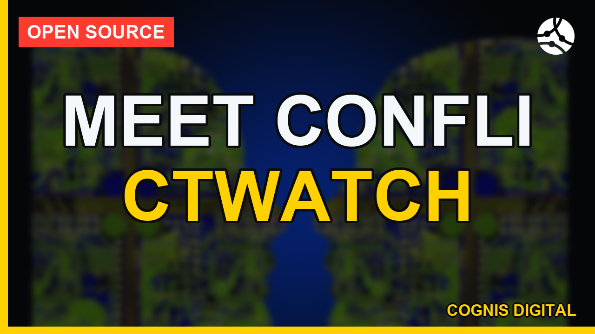

<a name="top"></a>
# conflictwatch

**Open-source conflict monitoring & situational awareness.** Ingest the standard open
conflict datasets (**ACLED / GDELT / UCDP**) and OSINT feeds into one normalized event
model, analyze **hotspots, timelines, actor activity and escalation trends**, and consult a
sourced **"what's working" lessons** knowledge base for awareness and force protection.

Built for the analyst and the modern soldier who needs a fast, private, recognized picture
from open sources — runs entirely on your own hardware, pure standard library.

Ships with a **111-entry counter-UAS / anti-drone knowledge base** ([COUNTER_UAS.md](COUNTER_UAS.md))
— what's actually working against drones in 2024–2026 (fiber-optic FPVs, acoustic nets,
RF/radar, EW, interceptor drones, counter-Shahed, layered C-UAS, AI autonomy, Western
systems, economics), sourced from open reporting; query it with `conflictwatch cuas`.

Ships with a **catalog of 290+ open conflict/OSINT sources** ([SOURCES.md](SOURCES.md)) —
datasets, trackers, think-tanks, GEOINT/imagery, flight/maritime/SDR tracking, drone &
electronic-warfare monitors, humanitarian/early-warning feeds, and OSINT tooling — plus a
**76-term [GLOSSARY.md](GLOSSARY.md)** of the acronyms, terms and entities of the trade
(OSINT, GEOINT, SIGINT, ISR, EW, C-UAS, FPV, PNT, TCCC, ADS-B, AIS, ACLED, GDELT, UCDP, …).

```mermaid
flowchart LR
  subgraph in["open sources"]
    A[ACLED / UCDP CSV]; G[GDELT 2.0]; R[OSINT RSS/Atom feeds]
  end
  in --> N[[ConflictEvent<br/>normalize + dedup]]
  N --> AN[analyze<br/>hotspots · timeline · actors · trend]
  N --> WA[watch<br/>escalation early-warning · 6 detectors]
  N --> CO[correlate<br/>clusters · actor-net · coordinated]
  N --> PO[posture<br/>I&W tiers · GREEN→RED]
  N --> TR[trends<br/>peaks · lulls · forecast]
  N --> EM[emit → STIX/MISP/Slack<br/>via cognis-connect]
  L[(lessons KB<br/>what's working)] --> RP[report · brief<br/>md · csv · kml · intsum]
  AN --> RP
  WA --> PO
  classDef c fill:#6b46c1,color:#fff; class N c;
```


<!-- cognis:example:start -->

## Watch the walkthrough

A full narrated tour — setup, the tool in action, and every demo scenario:

[](https://github.com/cognis-digital/conflictwatch/releases/download/walkthrough-v1/walkthrough.mp4)

▶ **[Watch the walkthrough (MP4)](https://github.com/cognis-digital/conflictwatch/releases/download/walkthrough-v1/walkthrough.mp4)**

## 🔎 Example output

Real, reproducible output from the tool — runs offline:

```console
$ conflictwatch --version
conflictwatch 0.7.0
```

```console
$ conflictwatch --help
usage: conflictwatch [-h] [--version]
                     {ingest,fetch-gdelt,scrape,analyze,export,lessons,report,cuas,watch,sources,feeds,sanctions,correlate,posture,trends,brief} ...

conflictwatch CLI - ingest open conflict data, analyze it, consult lessons.

positional arguments:
  {ingest,fetch-gdelt,scrape,analyze,export,lessons,report,cuas,watch,sources,feeds,sanctions,correlate,posture,trends,brief}
    ingest              parse an open conflict dataset into events
    fetch-gdelt         pull the latest open GDELT events export
    scrape              collect OSINT situational feeds (RSS/Atom)
    analyze             situational summary over an events file
    export              export events as STIX 2.1 or GeoJSON (native, no deps)
    lessons             query the 'what's working' lessons KB
    report              full situational report (summary + lessons hint)
    cuas                query the counter-UAS / anti-drone knowledge base
                        (2024-2026)
    watch               escalation early-warning: rank what is CHANGING
                        (spikes, trends, new actors, geo-spread, lethality
                        shifts)
    sources             query the 290+ open conflict/OSINT source catalog
    feeds               edge/air-gap data feeds (OFAC SDN, GDELT) —
                        list/update/get
    sanctions           cross-reference event actors against the OFAC SDN list
    correlate           find structure: spatio-temporal clusters, actor
                        network, type co-occurrence, coordinated days
    posture             defensive I&W posture per scope (GREEN/GUARDED/AMBER/
                        RED) from tempo, lethality, escalation, drone/UAS
                        share, geo-spread
    trends              temporal analytics: moving average, peaks, lulls,
                        weekday profile, naive trend forecast
    brief               human-readable report: markdown / csv / kml / intsum

options:
  -h, --help            show this help message and exit
  --version             show program's version number and exit
```

> Blocks above are real `conflictwatch` output — reproduce them from a clone.

**Sample result format** _(illustrative values — run on your own data for real findings):_

```
{
  "events": [
    {
      "id": "1234567890",
      "type": "Attack",
      "description": "Terrorist attack on a market in Paris",
      "location": {
        "lat": 48.8567,
        "long": 2.2945
      },
      "timestamp": "2023-02-15T14:30:00Z"
    },
    {
      "id": "2345678901",
      "type": "Protest",
      "description": "Massive protests against government in Moscow",
      "location": {
        "lat": 55.7558,
        "long": 37.6173
      },
      "timestamp": "2023-02-15T10:00:00Z"
    }
  ]
}
```

<!-- cognis:example:end -->

## Scope & ethics

conflictwatch is for **open-source intelligence, situational awareness, and force
protection** — descriptive monitoring of *reported* events and *defensive*
lessons-learned. It is **not** a targeting, fire-control, or weapon system, it does not
plan operations against people, and it is not for surveilling individuals. It reads public
datasets and public feeds only. Use it to understand a situation and protect people.

## Demos

Six runnable, **fully offline** scenarios in [`demos/`](demos/), each written for a
different audience and loading its own committed sample data. Run them all (they
double as smoke tests and each exits 0), or run one:

```bash
python demos/run_all.py                              # all five, end to end
python demos/02_force_protection_early_warning.py    # or just one
```

| # | Scenario | Audience | Shows |
|---|----------|----------|-------|
| 1 | [OSINT analyst](demos/01_osint_analyst_situational_report.py) | OSINT analysts | `analyze` — hotspots, actors, event mix, escalation trend |
| 2 | [Force protection](demos/02_force_protection_early_warning.py) | Force protection / early-warning | `watch` — 6 detectors rank the *delta*; replay shows lead time |
| 3 | [Journalist / researcher](demos/03_journalist_export_and_map.py) | Journalists & researchers | `intel` — GeoJSON map layer + STIX 2.1 bundle, zero deps |
| 4 | [NGO / humanitarian](demos/04_ngo_lessons_and_sanctions.py) | NGOs & humanitarian staff | `sanctions` OFAC SDN screening (offline) + protection lessons |
| 5 | [Collection manager](demos/05_collection_catalog_and_cuas.py) | Collection managers / planners | source `catalog` discovery + counter-UAS threat brief |
| 6 | [Watch officer](demos/06_watch_officer_correlation_posture.py) | Duty / watch officers | `correlate` clusters + `posture` I&W tiers + `trends` + INTSUM `brief` |

```mermaid
flowchart LR
    SD[(committed sample data<br/>ACLED · escalation · sanctions)] --> R[run_all.py]
    R --> D1[1 · analyze<br/>OSINT analyst]
    R --> D2[2 · watch<br/>force protection]
    R --> D3[3 · intel export<br/>journalist / researcher]
    R --> D4[4 · sanctions + lessons<br/>NGO / humanitarian]
    R --> D5[5 · catalog + cuas<br/>collection manager]
    classDef c fill:#6b46c1,color:#fff; class R c;
```

Full write-ups in [docs/DEMOS.md](docs/DEMOS.md); the end-to-end design is in
[docs/ARCHITECTURE.md](docs/ARCHITECTURE.md).

## Install

```bash
pip install "git+https://github.com/cognis-digital/conflictwatch.git"
```

## Use it

```bash
# 1) Ingest an open dataset (ACLED export shown; also gdelt / ucdp / json)
conflictwatch ingest --source acled --from-file acled_export.csv --out events.json

# 1b) Or pull the latest fully-open GDELT events export (no key)
conflictwatch fetch-gdelt --out events.json

# 1c) Or collect OSINT situational feeds (ISW / ACLED / ReliefWeb / Bellingcat …)
conflictwatch scrape --out osint.json

# Counter-UAS / anti-drone knowledge base (2024-2026 — fiber-optic, acoustic, EW, …)
conflictwatch cuas --topic fiber-optic-drones
conflictwatch cuas --keyword acoustic
conflictwatch cuas --systems            # every named system/program
conflictwatch cuas --stats

# Browse the 290+ source catalog (filter by category/type/access/region/keyword)
conflictwatch sources --stats
conflictwatch sources --category ukraine --access open
conflictwatch sources --has-rss --feeds          # just the RSS URLs (drives `scrape`)

# 2) Situational summary — hotspots, actors, escalation trend
conflictwatch analyze events.json --window 7

# 2b) Escalation EARLY-WARNING — rank what is CHANGING, not what is biggest
conflictwatch watch events.json --scope country --window 7
conflictwatch watch events.json --as-of 2026-06-10 --min-severity high  # replay a past day
conflictwatch watch events.json --detector new-hotspot --format json    # one detector, machine-readable

# 3) Full report (summary + awareness lessons keyed to what's happening)
conflictwatch report events.json

# 4) "What's working" lessons KB (awareness / force protection)
conflictwatch lessons --category counter-uas
conflictwatch lessons --keyword jamming

# 5) Export the picture — native, zero-dep, ingestible by maps & TIPs
conflictwatch export events.json --to geojson -o conflict.geojson   # Leaflet/Mapbox/QGIS/kepler
conflictwatch export events.json --to stix    -o conflict.json      # STIX 2.1 bundle for OpenCTI/TIPs

# 6) Sanctions screening — flag OFAC-sanctioned actors in your events (see below)
conflictwatch sanctions events.json --offline

# 7) Correlate — what goes together (clusters, actor network, coordinated days)
conflictwatch correlate events.json --mode clusters --radius-km 50
conflictwatch correlate events.json --mode actor-network --format json
conflictwatch correlate events.json --mode all

# 8) Defensive I&W posture — GREEN/GUARDED/AMBER/RED per area, with reasons
conflictwatch posture events.json --scope country --window 7

# 9) Temporal analytics — peaks, lulls, weekday profile, naive forecast
conflictwatch trends events.json --metric events --horizon 7

# 10) Human-readable brief — markdown / csv / kml / intsum
conflictwatch brief events.json --to markdown
conflictwatch brief events.json --to intsum
conflictwatch brief events.json --to kml -o conflict.kml    # Google Earth / QGIS overlay
```

**Export** turns events into a **GeoJSON** FeatureCollection (every geolocated
event as a point — drop it on a map) or a valid **STIX 2.1** bundle (each event →
`location` + `observed-data` + `note`, grouped in a `report`; deterministic ids).
Standard library only — no dependencies. For pushing a live Finding stream to
MISP/Splunk/Slack, see the cognis-connect bridge (`python -m conflictwatch.connect`).

Example `report` output:

```
CONFLICTWATCH situational summary  (2026-06-10 .. 2026-06-14)
  events: 8   fatalities: 28
  severity: {'high': 2, 'medium': 4, 'info': 2}
  trend (UP): recent 8 vs prior 0 (+100.0%)
  hotspots:
    Borderland   East Province   events=4  fatalities=17
  top actors:
    Forces of A                  events=6  fatalities=27
Relevant lessons (awareness):
  - [counter-uas] Small Drone Threats: low-cost drones used for surveillance and attack — integrate detection + layered defense
```

## Escalation early-warning (`conflictwatch watch`)

`analyze` shows you the snapshot; **`watch` shows you the delta** — it ranks *what is
changing* so the quiet village taking its first shelling isn't buried under the place that
was already the loudest yesterday. Six deterministic, auditable detectors run per scope
(`country` / `region` / `location` / `global`) over a recent window vs the trailing baseline:

| Detector | Catches |
|---|---|
| **spike** | sudden flare-ups (robust median + MAD z-score) |
| **sustained-trend** | slow build-ups a single spike test misses |
| **new-actor** | a unit/militia/capability appearing that was absent from the baseline |
| **geo-spread** | a front widening / conflict diffusing geographically |
| **lethality-shift** | violence getting deadlier even when tempo is flat |
| **new-hotspot** | a brand-new flashpoint crossing an activity floor |

Every alert carries its **severity** (volume-capped so a 0→2 blip can't outrank a 5→40
surge), **score**, a plain-language **reason**, and a machine-readable **evidence** block.
`--as-of <date>` replays the early-warning as it would have looked on a past day (honest
threshold tuning + after-action review). Standard library, deterministic, offline-capable.

```console
$ conflictwatch watch demos/sample_escalation.json --scope country --window 7
CONFLICTWATCH early-warning  (scope=country, window=7d, baseline=4x)
  6 alert(s)   highest=critical   by-severity={'critical': 4, 'low': 2}

  !!! [critical] spike            Borderland
        42 events in the last 7d vs a baseline median of 8/7d (robust z=12.8)  (score 12.75)
  !!! [critical] new-hotspot      Borderland
        'Newcross' surged to 42 events this window (was 0 across the 28d baseline)  (score 12.4)
  !!! [critical] lethality-shift  Borderland
        lethality rose to 3.4 fatalities/event (baseline 0.5)  (score 5.81)
  ...
```

Full write-up — detector math, the robust-statistics rationale, a walkthrough, and candid
threat/limitations notes — is in **[docs/EARLY_WARNING.md](docs/EARLY_WARNING.md)**.

## Correlation, posture, trends & briefs

`analyze` gives the snapshot and `watch` gives the delta; three more analysis modes read
deeper structure out of the same normalized events, and a fourth turns any of it into a
brief a person actually reads. All native, deterministic, offline.

**`correlate`** — what *goes together*. A **spatio-temporal cluster** groups events that
are close in *both* place and time (single-link agglomeration over haversine distance + a
day gap — the coordinated push, the bad night in one sector). An **actor network** returns
the weighted belligerent graph (who shows up with/against whom) for any network tool.
**Co-occurrence** surfaces event-type pairs that recur in the same place+window; and
**coordinated-days** flags days when activity flares across many places at once.

```console
$ conflictwatch correlate demos/sample_correlation.json --mode clusters
2 spatio-temporal cluster(s):

  cluster: 5 events, 16 fatalities (2026-06-08..2026-06-11, 3d span)
    centroid ~(48.634, 37.13), radius 6.3km  countries=['Borderland']
    actors: Forces of A, Forces of B, Volunteer Brigade
```

**`posture`** — a defensive **Indications & Warning** advisory per scope, GREEN / GUARDED /
AMBER / RED, built from five transparent, bounded sub-scores (tempo, lethality, escalation,
drone/UAS share, geo-spread), each with a stated reason and a set of *descriptive defensive
advisories* (increase dispersion, review overhead cover, brief the drone threat, …). It
tells people **how alert to be and why** — it does not target, task, or recommend force.

```console
$ conflictwatch posture demos/sample_escalation.json --scope country
CONFLICTWATCH I&W posture  (scope=country, window=7d)
  2 scope(s)   highest=RED   by-tier={'RED': 1, 'GREEN': 1}

  !!! [RED    ] Borderland  (score 0.82, 42 events / 143 fatalities)
        - Activity tempo is rising — refresh the local picture more often ...
        - Drone/UAS and explosive-remote activity is prominent — brief the small-drone threat ...
```

**`trends`** — temporal *shape*: a smoothed moving average, robust **peak** detection (the
bad days worth annotating), **lull** detection (a fragile calm), a **weekday profile**, and
a deliberately simple, clearly-labelled linear **forecast** (trend line for human context,
not a black box to act on blindly).

**`brief`** — the same picture as a **markdown** situational report, a **csv** timeline for
a spreadsheet, a severity-colour-coded **kml** map overlay for Google Earth / QGIS, or a
terse **INTSUM** plaintext handover (BLUF / situation / assessment).

```python
from conflictwatch import correlate, indicators, trends, reports
print(correlate.clusters(events, radius_km=50)[0]["actors"])
print(indicators.summary(events, scope="country")["highest"])   # 'red' | 'amber' | ...
print(trends.forecast(events)["direction"])                      # 'rising' | 'flat' | 'falling'
print(reports.to_intsum(events, area="EAST SECTOR"))
```

## Edge data feeds + OFAC sanctions screening

conflictwatch ships an **edge / air-gap-deployable** data-feed layer
(`conflictwatch/datafeeds.py` + catalog `conflictwatch/data_feeds_2026.json`,
standard-library only) that fetches real, keyless public feeds over HTTPS, caches
them to disk, and **re-serves them offline** so the tool keeps working on
disconnected gear. This repo consumes two feeds from the catalog:

| feed id    | source (real, public, keyless)                              | used for |
|------------|-------------------------------------------------------------|----------|
| `ofac-sdn` | US Treasury OFAC SDN list — https://www.treasury.gov/ofac/downloads/sdn.csv | sanctions cross-reference of event actors |
| `gdelt`    | GDELT 2.0 global event stream — http://data.gdeltproject.org/gdeltv2/lastupdate.txt | latest 15-min open conflict event export |

```bash
conflictwatch feeds list                 # the feeds this repo consumes + cache freshness
conflictwatch feeds update ofac-sdn      # fetch + cache (online)
conflictwatch feeds get gdelt --offline  # re-serve from cache, never touches the network
```

### Real enrichment — OFAC SDN actor screening

`conflictwatch sanctions <events.json>` cross-references every event's `actor1` /
`actor2` against the **OFAC Specially Designated Nationals (SDN)** list (primary
names **and** `a.k.a.` aliases parsed from the SDN remarks field). When a militia,
paramilitary group, vessel, or individual in your event stream is OFAC-sanctioned,
it is surfaced with the SDN program (e.g. `SDGT`, `RUSSIA-EO14024`) — which changes
the reporting and legal posture of the situational picture.

```
$ conflictwatch sanctions demos/sample_events_sanctions.json --offline
OFAC SDN screening: 3 of 4 events name a sanctioned actor

[2026-06-18] Mali  event 24e3...   actor 'Wagner Group' -> SDN 'WAGNER GROUP'   (/RUSSIA-EO14024) [STRONG]
[2026-06-19] Lebanon event ...     actor 'Hizballah'    -> SDN 'HIZBALLAH'      (/SDGT) [STRONG]
[2026-06-19] Yemen  event ...      actor 'Houthis'      -> SDN 'ANSARALLAH'     (/SDGT) [STRONG]   # alias resolved
```

Run the demo: `python examples/04_sanctions_enrichment.py`.

### Air-gap / sneakernet workflow

On a connected box, cache the feed and tar it; carry it to the disconnected
enclave; import and run everything `--offline`:

```bash
# connected side
conflictwatch feeds update ofac-sdn
conflictwatch feeds snapshot-export sdn.tar.gz

# air-gapped side (after sneakernet)
conflictwatch feeds snapshot-import sdn.tar.gz
conflictwatch sanctions events.json --offline    # zero network
```

The cache location is `COGNIS_FEEDS_CACHE` (default `~/.cache/cognis-feeds`).
The committed test suite points it at a trimmed offline snapshot under
`tests/fixtures/feeds_cache/`, so CI runs the full enrichment with **no network**.

## From Python

```python
from conflictwatch import sources, analyze, lessons, sanctions, correlate, indicators, trends, reports
events = sources.parse("acled", open("acled_export.csv", encoding="utf-8").read())
print(analyze.summary(events)["hotspots"])
print(lessons.query(category="ew-spectrum"))
print(correlate.clusters(events)[:1])            # spatio-temporal clusters
print(indicators.summary(events)["highest"])     # defensive I&W posture

# flag OFAC-sanctioned actors (offline once the SDN feed is cached)
for hit in sanctions.screen_events(events, offline=True):
    print(hit["date"], hit["matches"])
```

## The "what's working" lessons KB

A sourced, descriptive knowledge base of how modern conflict is actually being fought,
across **counter-UAS, EW/spectrum, comms/C2, survivability, casualty-care, logistics,
ISR/OSINT, mobility, info-ops** — each entry is an observed trend with OSINT **indicators**
and **defensive countermeasures**. Drafted with a local model and human-reviewed; entirely
awareness/protection oriented (`conflictwatch/data/lessons.json`).

## Source catalog (290+) & glossary

[SOURCES.md](SOURCES.md) is the full, queryable catalog (`conflictwatch sources`) across:
**conflict-event datasets** (ACLED, GDELT, UCDP, GTD, SIPRI, PRIO, COW, V-Dem) · **Ukraine**
(ISW, DeepStateMap, Oryx, CIT, Bellingcat) · **MENA** (SOHR, Airwars, Yemen Data Project) ·
**Africa/Sahel** · **Indo-Pacific** (AMTI, 38 North, SCSPI) · **think-tanks** (RUSI, CSIS,
IISS, RAND, War on the Rocks) · **humanitarian/early-warning** (ReliefWeb, HDX, IOM DTM,
ACAPS, FEWS NET, IPC) · **GEOINT** (Copernicus/Sentinel, NASA FIRMS, Maxar, Planet,
GeoConfirmed, SunCalc) · **tracking** (ADS-B Exchange, Flightradar24, MarineTraffic,
CelesTrak, WebSDR) · **drone/EW** (The War Zone, GPSJAM, Drone Wars UK) · **news** wires
with RSS · **OSINT tooling** (OSINT Framework, Bellingcat toolkit, Maltego, SpiderFoot) ·
and curated analyst bookmarks.

88 sources expose RSS — `conflictwatch scrape` pulls straight from the catalog. See
[GLOSSARY.md](GLOSSARY.md) for the 76 acronyms/terms/entities used throughout.

## Integrations & interop

Forward events to STIX/MISP/Sigma/Splunk/Elastic/Slack/webhooks via
[`cognis-connect`](https://github.com/cognis-digital/cognis-connect) —
`conflictwatch ... | python -m conflictwatch.connect --to stix`. See
[INTEGRATIONS.md](INTEGRATIONS.md) and [INTEROP.md](INTEROP.md). Pairs with
[`maritimeint`](https://github.com/cognis-digital/maritimeint),
[`uaslog`](https://github.com/cognis-digital/uaslog), and the drone-OSINT repos.

## License

[COCL 1.0](LICENSE) — © 2026 Cognis Digital LLC.

<div align="right"><a href="#top">↑ back to top</a></div>
