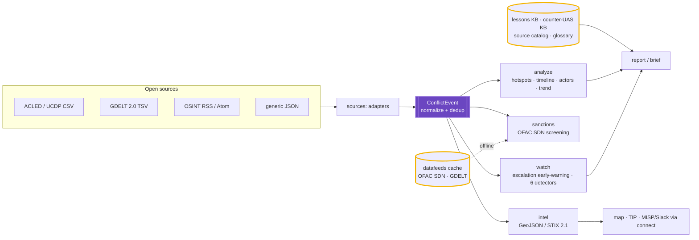
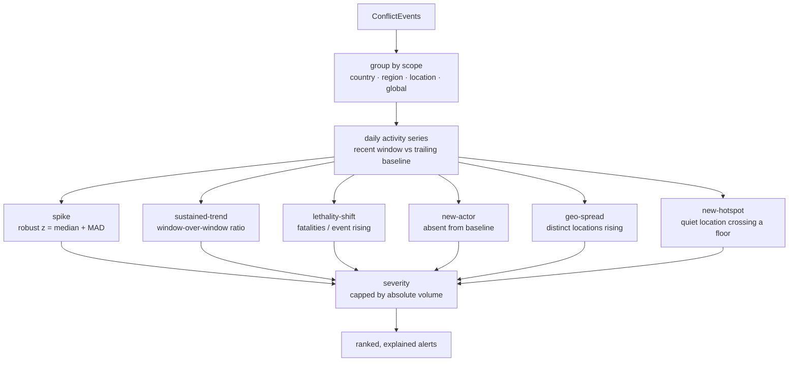

# Architecture

`conflictwatch` turns open conflict data and OSINT feeds into a private, queryable
situational picture — hotspots, escalation early-warning, sanctioned-actor
screening, and shareable map/STIX exports — entirely on local hardware, with no
dependencies beyond the Python standard library. This document explains how the
pieces fit together, end to end.

## Scope

Descriptive, open-source **situational awareness and force protection** only.
`conflictwatch` monitors *reported* events and surfaces *defensive* lessons. It is
not a targeting, fire-control, or weapon system; it does not plan operations and it
does not surveil individuals. It reads public datasets and public feeds.

## The pipeline

## Components

### Event contract (`conflictwatch/events.py`)
`ConflictEvent` is the one normalized record every source maps to — *who did what,
where, when, and how bad*. `normalize()` maps a wide alias table (ACLED/GDELT/UCDP
field names) onto the canonical fields, coerces dates and the event taxonomy, and
derives a stable content `id`; `dedupe()` collapses repeats by that id. `severity`
is a derived property (from fatalities + event type), not stored.

### Source adapters (`conflictwatch/sources.py`)
One parser per open dataset — `acled` (CSV), `ucdp` (GED CSV), `gdelt` (2.0 TSV),
and `json` (any tool's list/`{events:[…]}`) — each emitting normalized events. The
fully-open, keyless GDELT export can be fetched live (`fetch_gdelt_latest`); the
registration-gated datasets are ingested from a `--from-file` export you pulled.

### Analysis (`conflictwatch/analyze.py`)
The descriptive snapshot: `hotspots`, `timeline`, `actor_activity`, `by_type`, and
a window-over-window `trends` escalation check, rolled up by `summary()`. Pure
stdlib, deterministic.

### Escalation early-warning (`conflictwatch/watch.py`)
Answers the harder question — *what is changing, fast enough to act on?* Six
deterministic, auditable detectors run per scope over a recent window vs the
trailing baseline. Severity is volume-capped so a tiny blip can't outrank a real
surge, and every alert carries its evidence.

### Sanctions screening (`conflictwatch/sanctions.py`)
Cross-references each event's `actor1` / `actor2` against the **US Treasury OFAC
SDN** list (primary names *and* `a.k.a.` aliases parsed from the SDN remarks), via
a token index. A full token-subset is a strong hit; otherwise ≥2 shared
significant tokens. The SDN list is supplied by the data-feed layer, so this works
air-gapped once cached.

### Data feeds (`conflictwatch/datafeeds.py`, catalog `data_feeds_2026.json`)
Fetches real, keyless public feeds (OFAC SDN `sdn.csv`, GDELT 2.0) over HTTPS,
caches them to disk (`COGNIS_FEEDS_CACHE`), and **re-serves them offline** so the
tool keeps working on disconnected gear. `snapshot-export` / `snapshot-import` tar
the cache for sneakernet transfer into an enclave.

### Intel export (`conflictwatch/intel.py`)
Native, dependency-free export of events to **GeoJSON** (a point layer for
Leaflet/Mapbox/QGIS/kepler.gl) and **STIX 2.1** (a valid bundle pairing a
`location` + `observed-data` + `note` per event, grouped in a `report`, with
deterministic UUIDv5 ids for byte-stable diffs).

### Knowledge bases (`conflictwatch/lessons.py`, `cuas.py`, `catalog.py`)
Three sourced, queryable JSON corpora: the **"what's working" lessons KB**
(descriptive, defensive lessons across counter-UAS, EW, comms/C2, survivability,
casualty-care, logistics, ISR/OSINT, mobility, info-ops), the **counter-UAS KB**
(2024–2026 anti-drone OSINT), and the **290+ source catalog** that also supplies the
RSS feeds the scraper consumes.

### Interop (`conflictwatch/connect.py`)
Forwards a Finding stream to STIX/MISP/Sigma/Splunk/Elastic/Slack/webhooks via the
optional `cognis-connect` SDK. See `INTEGRATIONS.md` / `INTEROP.md`.

## Why these choices

- **Stdlib only, no daemon.** Everything is files and pure-Python modules you can
  copy, diff, and ship. Nothing leaves your machine.
- **Offline / air-gap by design.** Feeds cache and re-serve; the demos and test
  suite run with zero network against committed snapshots.
- **Deterministic + auditable.** The detectors are boring statistics an analyst can
  reproduce by hand, and exports use stable ids — no opaque scoring, no models.
- **Descriptive, not directive.** The whole pipeline flags *reported* activity for
  human review. It informs awareness and protection; it does not task force.
