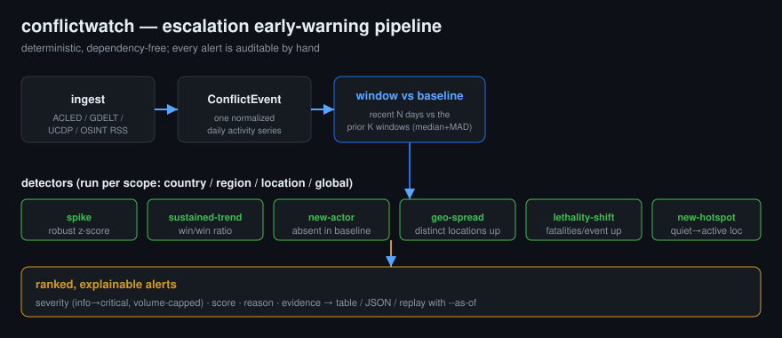

# Escalation early-warning (`conflictwatch watch`)

> Scope reminder: this is descriptive open-source **early-warning for awareness, force
> protection, and humanitarian response**. It flags *reported* escalation for a human to
> review. It does not target, recommend force, task collection, or rank people. See
> [Scope & ethics](../README.md#scope--ethics).



*Diagram: generated SVG, MIT-style reuse, © Cognis Digital LLC.*

## Why a separate command from `analyze`

`conflictwatch analyze` answers **"what does the picture look like right now?"** — totals,
hotspots, top actors, a single recent-vs-prior trend number. That is a *snapshot*. The
problem with a snapshot is that the eye is drawn to wherever the absolute numbers are
biggest, which is almost always the place that was already the biggest yesterday. The most
dangerous thing in conflict monitoring is rarely the loudest place on the map — it is the
place that just got 5× louder, or the quiet village that just took its first shelling, or
the new unit insignia that showed up in the reporting this week.

`conflictwatch watch` answers the harder question: **"what is changing, and is it changing
fast enough to act on?"** It is a deliberate, boring, *auditable* early-warning layer. There
is no model to train and no opaque score — every alert carries the exact numbers that
triggered it so an analyst can sanity-check it in ten seconds and decide whether to escalate
to a human chain.

## The detectors

All six run independently, per scope (`country` / `region` / `location` / `global`), over a
recent **window** (default 7 days) compared against a **baseline** of the prior `K` windows
(default 4, i.e. the trailing 28 days).

| Detector | Fires when… | Catches |
|---|---|---|
| **spike** | recent window's event count is a large positive robust z-score (median + MAD) over baseline windows | sudden flare-ups |
| **sustained-trend** | recent window ≥ 1.5× the immediately prior window (with a volume floor) | slow build-ups a single spike test misses |
| **new-actor** | an actor appears in the recent window but is absent from the *entire* baseline | force-composition change: a new unit, militia, or capability arriving |
| **geo-spread** | the count of distinct active locations rises ≥ 2 window-over-window | a front widening / conflict diffusing geographically |
| **lethality-shift** | fatalities-per-event at least doubles (and rises by ≥ 1.0) | the *character* of violence getting deadlier even when tempo is flat |
| **new-hotspot** | a location crosses an absolute activity floor having been quiet/absent before | a brand-new flashpoint emerging |

### Robust statistics on purpose

The spike detector uses **median + MAD (median absolute deviation)** rather than mean +
standard deviation. Conflict series are spiky and heavy-tailed; a single big day in the
baseline would inflate a normal standard deviation and *hide* the next spike. The median and
MAD are insensitive to exactly those outliers, so the baseline stays a faithful picture of
"normal" even after a bad week.

When the baseline is perfectly flat (MAD = 0 — common on quiet series), the detector falls
back to scaling the raw excess by the baseline level: 0→3 events on a sleepy series reads as
meaningful, but 50→53 on a busy one does not.

### Severity is volume-capped

A detector score is normalized to a tier (`info` → `critical`). That tier is then **capped by
the absolute event volume driving it**, so a 0→2 blip on an empty series can never outrank a
5→40 surge no matter how large its z-score. Concretely: fewer than 3 events caps at `low`,
fewer than 8 caps at `medium`, fewer than 20 caps at `high`. This is the single most important
piece of noise control — without it, every quiet corner of the map screams "critical" the
first time anything happens there.

## Walkthrough: a border surge

The repo ships a deterministic fixture, `demos/sample_escalation.json`, encoding a known
scenario: **Borderland** has a quiet ~1–2 events/day baseline for four weeks, then a seven-day
surge — a *new location* (`Newcross`), a *new actor* (`Volunteer Brigade`), and rising
fatalities. A second country, **Calmland**, stays quiet throughout and must never raise a
high-severity alert.

```console
$ conflictwatch watch demos/sample_escalation.json --scope country --window 7
CONFLICTWATCH early-warning  (scope=country, window=7d, baseline=4x)
  6 alert(s)   highest=critical   by-severity={'critical': 4, 'low': 2}

  !!! [critical] spike            Borderland
        42 events in the last 7d vs a baseline median of 8/7d (robust z=12.8)  (score 12.75)

  !!! [critical] new-hotspot      Borderland
        'Newcross' surged to 42 events this window (was 0 across the 28d baseline)  (score 12.4)

  !!! [critical] lethality-shift  Borderland
        lethality rose to 3.4 fatalities/event (baseline 0.5)  (score 5.81)

  !!! [critical] sustained-trend  Borderland
        activity up 5.2x window-over-window (8 -> 42 events)  (score 4.75)

  .   [low     ] spike            Calmland
        2 events in the last 7d vs a baseline median of 1/7d (robust z=3.0)  (score 3.0)

  .   [low     ] new-actor        Borderland
        1 actor(s) appeared this window absent from the 28d baseline: Volunteer Brigade  (score 1.7)
```

Read that top-to-bottom and you have a one-line situation update: *Borderland has a critical,
multi-signal escalation centred on a brand-new flashpoint with deadlier-than-usual violence;
Calmland is statistically unremarkable.* Note that Calmland's spike has a high z-score (3.0)
but is correctly pinned to `low` by the volume cap — exactly the behaviour you want.

### Replay: "would we have seen it coming?"

`--as-of` evaluates the early-warning exactly as it would have looked on a past day, which is
how you tune thresholds honestly (no hindsight leakage) and how you write a credible
after-action review.

```console
$ conflictwatch watch demos/sample_escalation.json --as-of 2026-06-10 --min-severity medium
CONFLICTWATCH early-warning  (scope=country, window=7d, baseline=4x)
  0 alert(s)   highest=info   by-severity={}
  no escalation signals above threshold.
```

On 10 June — before the surge — nothing fired. By 20 June it is screaming critical. That gap
is your lead time.

### JSON for pipelines

```console
$ conflictwatch watch demos/sample_escalation.json --scope global --format json
```

Every alert is `{detector, scope, severity, score, reason, evidence}`. The `evidence` block is
machine-readable (raw counts, ratios, the new locations/actors), so the output drops straight
into a SIEM rule, a paging threshold, a daily intel email, or a downstream
[`cognis-connect`](../INTEGRATIONS.md) Finding stream. Combine with `conflictwatch export
--to geojson` to put the flagged scopes on a map.

## Defensive / threat context — frank notes

A few things to be candid about, because pretending a tool is magic is how analysts get
burned:

- **Garbage in, garbage out.** Machine-coded event feeds (GDELT in particular) mis-attribute,
  duplicate, and geolocate to country centroids. `watch` inherits every bias in the source.
  The `--as-of` replay exists precisely so you can calibrate against ground truth before you
  trust a threshold. Treat alerts as *prompts to look*, never as conclusions.
- **Reporting volume ≠ event volume.** A "spike" can be a real escalation **or** a press cycle
  — a single atrocity that 40 outlets cover looks identical to 40 separate clashes at the
  event-count layer. Cross-check spikes against the `lethality-shift` and `new-hotspot`
  signals and against the underlying notes before acting.
- **Absence of an alert is not safety.** Sub-threshold, slow-burn, and deliberately-low-signature
  activity will not trip these detectors. This is an *early-warning aid for humans*, not an
  autonomous tripwire, and it must never be the only thing watching.
- **New-actor is a naming artefact as much as an order-of-battle change.** A new transliteration
  of the same militia reads as a "new actor". That is still useful (it tells you the reporting
  vocabulary shifted) but do not infer a literal new formation from it alone.
- **Thresholds are policy, not physics.** The defaults (1.5× trend, z ≥ 2, the volume caps) are
  reasonable starting points, not truth. Tune `--window`, `--baseline-windows`, and
  `--min-severity` to your theatre's tempo, then lock them with `--as-of` backtests.

The whole module is standard-library, deterministic, and offline-capable — it runs unchanged on
disconnected edge gear using the air-gap feed cache (`conflictwatch feeds snapshot-import`), so
the early-warning keeps working when the network does not.
